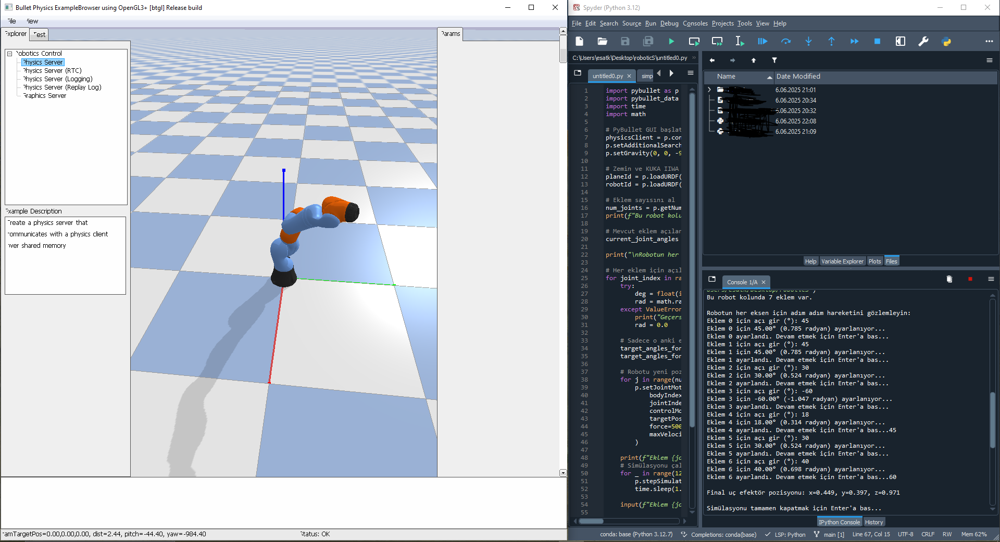

#  Robot Arm FK Simulator

This project provides a **Forward Kinematics (FK)** simulation for robotic arms with 2 or more Degrees of Freedom (DOF). It calculates the position of the end-effector based on user-provided joint angles and visualizes the robot arm in 2D (and optionally in 3D).

---




##  Features

- [x] Symbolic computation of Denavit–Hartenberg (DH) transformation matrices
- [x] User input for joint angles (in degrees)
- [x] Calculates 3D position of the end-effector
- [x] 2D robot arm visualization using matplotlib
- [x] Supports 3 or more DOF arms (modular design)
- [x] 3D visualization support (coming soon) 
- [ ] Inverse kinematics & control algorithms (planned)

---

## 🛠 Technologies Used

- Python 3.x
- [SymPy](https://www.sympy.org/en/index.html) – Symbolic math library
- [NumPy](https://numpy.org/) – Numerical computations
- [Matplotlib](https://matplotlib.org/) – Visualization
- [PyBullet](https://pybullet.org/wordpress/) - Real-Time Physics Simulation
---

##  Installation

```bash
git clone https://github.com/yourusername/robot-arm-fk-simulator.git
cd robot-arm-fk-simulator
pip install -r requirements.txt
pip install sympy numpy matplotlib
pip install pybullet
pip install pybullet_data
python fk_simulation.py
```
##  License

This project is licensed under the [MIT License](LICENSE) — © 2025 Mahmut Esat Kolay


